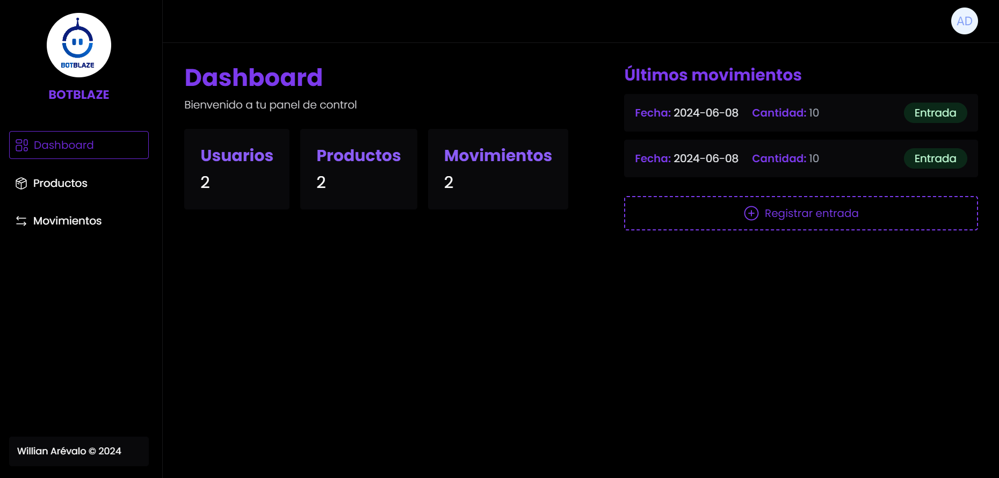

<p align="center"><a href="https://laravel.com" target="_blank"></a></p>

## Prueba Técnica Laravel


1. [Introducción](#introducción)
2. [Instalación](#instalación)
3. [Uso](#uso)
4. [Páginas](#páginas)
5. [Estructura](#estructura)
6. [Funcionamiento básico de la aplicación](#funcionamiento-básico-de-la-aplicación)
7. [Credenciales](#credenciales)


## Introducción
Creación de un sistema básico para administrar productos y parte de su inventario, se registran los productos, y por consecuente se van registrando sus entradas y salidas, manteniendo un historial de ellas.

Tecnologías utilizadas:

- [Laravel](https://laravel.com).
- [Tailwind CSS](https://tailwindcss.com/).
- [jQuery](https://jquery.com).
- [Toastify JS](https://apvarun.github.io/toastify-js/).

Iconos:

- [HugeIcons](https://hugeicons.com/icons).


## Instalación

Clonar repositorio: https://github.com/WillianArevalo/willian-botblaze


## Uso

Ejecutar los siguientes comandos:

```npm run dev``` para compilar los assets.

```php artisan migrate``` para crear las tablas en la base de datos.

```php artisan db:seed``` para poblar la base de datos.

```php artisan serve``` para iniciar el servidor.


## Páginas

### Inicio de Sesión 
    Página de inicio de sesión.


### Dashboard
    Página principal del sistema, muestra un resumen de los movimeintos de los productos.



### Productos
    Página donde se listan los productos registrados, se pueden agregar, editar y eliminar productos.


### Movimientos
    Página donde se listan los movimientos de los productos, se pueden agregar, editar y eliminar movimientos.


### Estructura 

La conexión entre el modelo, el controlador y la ruta sigue un patrón comun en Laravel MVC.

- **Modelo**: Se encuentra en la carpeta `app/Models`.
    Es el responsable de interactuar con la base de datos. Representa la estructura de los datos de las tablas de Usuario, Productos y Movimientos.

    En la aplicación, los modelos son:
    - `User`: Representa la tabla de usuarios.
    - `Product`: Representa la tabla de productos.
    - `Movement`: Representa la tabla de movimientos.

- **Controlador**: Se encuentra en la carpeta `app/Http/Controllers`.
    Es el responsable de manejar las peticiones del usuario, interactuar con el modelo y devolver una respuesta.
    Cada controlador tiene un método que se encarga de mostrar la vista correspondiente y de obtener los datos necesarios para mostrarla.

    En la aplicación, los controladores son:
    - `LoginController`: Controlador de inicio de sesión, valida la sesión y muestra la vista del login.
    - `DashboardController`: Controlador de la página principal.
    - `ProductController`: Controlador de los productos (crear, eliminar, editar y ver).
    - `MovementController`: Controlador de los movimientos (crear, eliminar, editar).


- **Rutas**: Se encuentra en el archivo `routes/web.php`.
    Es el responsable de definir las rutas de la aplicación, es decir, las URL que el usuario puede visitar y las acciones que se deben realizar cuando se visita una URL en específico.

    En la aplicación, las rutas son:
    - `/`: Ruta de la página principal (Login).
    - `/logout`: Ruta para cerrar sesión.
    - `/products`: Ruta de la página de productos.
    - `/movements`: Ruta de la página de movimientos.
    - `/dashboard`: Página principal de la aplicación.


## Funcionamiento básico de la aplicación

    Registro de Productos
    - Se puede registrar un producto en la página de productos.
    - Se debe ingresar el nombre, la descripción y la cantidad inicial del producto.
    - Al registrar un producto, se crea un movimiento de entrada con la cantidad inicial.

    Registro de Movimientos
    - Se puede registrar un movimiento en la página de movimientos.
    - Se debe seleccionar el producto,la cantidad, la descripción y la fecha.
    - Al registrar un movimiento, se actualiza la cantidad del producto y se crea un registro en la tabla de movimientos.

    Edición de Productos
    - Se puede editar un producto en la página de productos.
    - Se puede editar el nombre, la descripción y la cantidad del producto.
    - No se puede editar la cantidad si existen movimientos registrados.
    
    Edición de Movimientos
    - Se puede editar un movimiento en la página de movimientos.
    - Se puede editar el producto, el tipo de movimiento y la cantidad.
    

#### Credenciales

- Correo: admin@gmail.com
- Contraseña: admin


